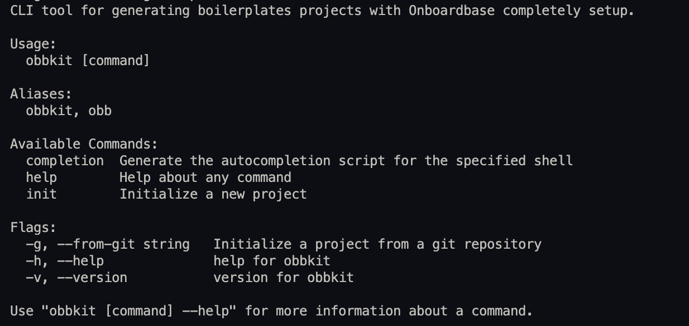
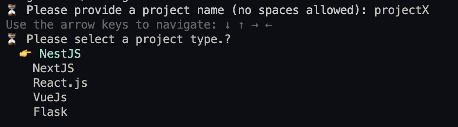
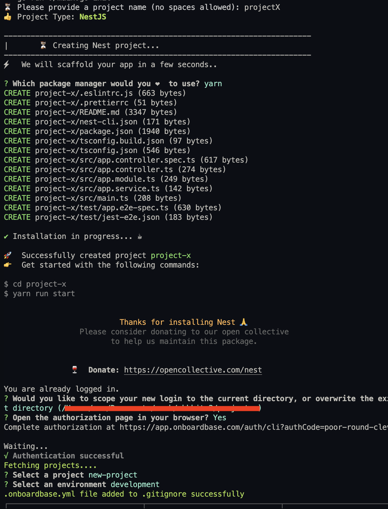

# Overview
**Onboardbase Kit** (onboardbasekit) is a CLI tool for generating boilerplates with onboardbase preconfigured in them as a SecretOps infrastucture.

# Installation

Install with Go:
```
go install github.com/Onboardbase/onboardbasekit@latest
```

Install with Brew:
```
brew tap onboardbase/onboardbasekit

brew install onboardbasekit
```

# Usage
Run to see all the commands available
```
onboardbasekit help
```

This will display information about the CLI



To get more information about a command run the command with `-h`, for example:
```
onboardbasekit init -h
```

We also have artifacts for different system architechtures [here](https://github.com/Onboardbase/onboardbasekit/releases)

## Initializing a Project
Run the init command:
```
onboardbasekit init
```
After providing the project name, you can select a project type:


**Note**: *You must have the build tools needed to create the project you selected. For example, if you selected a project type based on NodeJS e.g NestJs, Next.js, you must have Node.js already installed on your computer*

After selecting a project type, you will be prompted to complete the flow for creating project:



## Initializing a Project From Git Repository
**Note**: *You must have git installed and configure on your machine to do this*

onboardbasekit can also automatically setup a project directrly from a github repo. It will attempt to clone the repository and then configure Onboardbase inside of it. This means that you must have the permission to clone the repository if it's a private repository.

To initialize from a git reposity run
```
onboardbasekit init --from-git [git-repository]

e.g

onboardbasekit init --from-git https://github.com/Onboardbase/Flask-Starterkit.git
```

# Contributing

## Local Setup
Clone this repo and run `go mod`. You can then start the application with `go run main.go`

## Adding More Project Types

Support for other frameworks are welcome. The easiest way to add a new project type support is to extend our git integration.

If you want to a new project type and there is a popular, open source community-vested boilerplate repository for that project type, you can make a PR to include that. The `kit/flask.go` is a reference for how to do just that.

You will then need to add the project type to the `project_types/types` const, this is the current list we have:
```
const (
	Nestjs  = "NestJS"
	Nextjs  = "NextJS"
	Reactjs = "React.js"
	Vuejs   = "VueJs"
	Flask   = "Flask"
)
```

Afterwards, you will need to include the new project type inside of `kit/init.go`:
```
func collectProjectType() string {
    ...
	items := []string {
		project_types.Nestjs,
		project_types.Nextjs,
		project_types.Reactjs,
		project_types.Vuejs,
		project_types.Flask,
	}
    ...
}

```

We have a simple sequence diagram for the project here `docs/images/OBB_Kit_flow.png`
